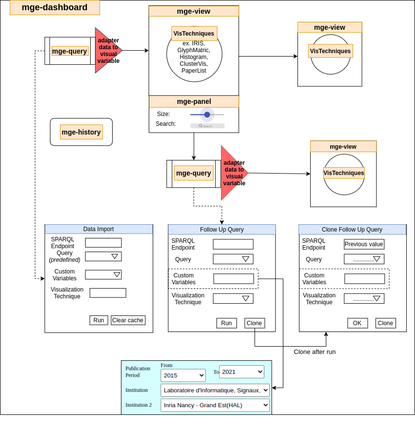

## LDViz (Linked Data Visualization)

LDViz is a generic web-based visualization tool for LOD exploration. It supports data visualization through multiple perspectives provided by the MGExplorer tool (described below) from any SPARQL endpoint that is W3C compliant, i.e. SPARQl endpoints that provide SPARQL select result sets using JSON in the format defined by the W3C Recommendation. 

### MGExplorer (Multidimensional Graph Explorer)

MGExplorer is a visualization tool based on the concept of chained views to support the incremental exploration of large, multidimensional datasets. Further to supporting the exploration of dat through multiple perspectives delievered via several complementary techniques, it visualizes provenance information to enable users to retrace their analytical actions and to discover alternative exploratory paths without loosing information on previous analyses. 

## Setup
**Developed Dependencies**

|   Name   |  Version  |
| -------- | --------- |
| @stencil/store| 1.4.1|
| @types/jest| 26.0.21|
| @types/puppeteer| 5.4.3|
| jest| 26.6.3|
| jest-cli| 26.6.3|
| rollup-plugin-node-polyfills| 0.2.1|

**Dependencies and libraries**

|   Name   |  Version  |
| -------- | --------- |
| @stencil/core| 2.5.2|
| @types/sweetalert| 2.0.4|
| autocompleter| 6.1.0|
| babel-plugin-transform-remove-strict-mode| 0.0.2|
| cors| 2.8.5|
| d3| 6.0.0|
| d3-simple-slider| 1.10.4|
| ejs| 3.1.6|
| express| 4.17.1|
| express-fileupload| 1.2.1|
| jquery| 3.6.0|
| jquery-ui| 1.12.1|
| lodash| 4.17.21|
| model-js| 0.2.5|
| morgan| 1.10.0|
| nodemon| 2.0.12|
| patch-package| 6.4.7|
| puppeteer| 8.0.0|
| requirejs| 2.3.6|
| sweetalert2| 11.0.18|
| tippy.js| 6.3.1|
| xmlhttprequest| 1.8.0|

To use this project, clone the repository and run the following commands:

```bash
# Install dependencies and libraries
npm install
# Build application before run server side
npm run build
# Run application via Server side
npm run start:ssr
```

Obs.: part of the tool requires authentication. For that, create a file caleld `users.json` and place it inside the `data/` folder. It should contain the list of users that can access the tool. The expected format is a list of JSON objects such as :

`{ "id": 5, "name": "username", "email": "username@ldviz.com", "password": "password" }`


## License

See the [LICENSE file](LICENSE).

## Cite this work

Aline Menin, Catherine Faron Zucker, Olivier Corby, Carla Dal Sasso Freitas, Fabien Gandon, et al.. From Linked Data Querying to Visual Search: Towards a Visualization Pipeline for LOD Exploration. WEBIST 2021 - 17th International Conference on Web Information Systems and Technologies, Oct 2021, Online Streaming, France. [DOI](https://dx.doi.org/10.5220/0010654600003058). [hal-03404572](https://hal.archives-ouvertes.fr/hal-03404572)

Aline Menin, Ricardo Cava, Carla Dal Sasso Freitas, Olivier Corby, Marco Winckler. Towards a Visual Approach for Representing Analytical Provenance in Exploration Processes. IV 2021 - 25th International Conference Information Visualisation, Jul 2021, Melbourne / Virtual, Australia. pp.21-28, [DOI](https://dx.doi.org/10.1109/IV53921.2021.00014). [hal-03292172](https://hal.archives-ouvertes.fr/hal-03292172)

Aline Menin, Minh Do, Carla Dal Sasso Freitas, Olivier Corby, Catherine Faron Zucker, et al.. Using Chained Views and Follow-up Queries to Assist the Visual Exploration of the Web of Big Linked Data. International Journal of Human-Computer Interaction, Taylor & Francis, In press. [hal-03518845](https://hal.archives-ouvertes.fr/hal-03518845)

--------------------
## MGExplorer specification

**Table of contents**

1. [Components](#1-components)

    1.1.  [mge-dashboard](#11-mge-dashboard)

    1.2.  [mge-query](#12-mge-query)
    
    1.3.  [mge-view](#13-mge-view)

    1.4.  [mge-panel](#14-mge-panel)
    
    1.5. [mge-history](#15-mge-history)


2. [Visualization techniques](#2-visualization-techniques)

    2.1. [mge-barchart](#21-mge-barchart)

    2.2. [mge-clustervis](#22-mge-clustervis)

    2.3. [mge-glyph-matrix](#23-mge-glyph-matrix)

    2.4. [mge-iris](#24-mge-iris)

    2.5. [mge-listing](#25-mge-listing)

    2.6. [mge-nodelink](#26-mge-nodelink)


As shown in the figure below, MGExplorer includes 6 main elements. These elements are composed by Web components, as described in the following.



- Dashboard component (`mge-dashboard`): This is where visual chart views (`mge-view`) are stored and managed. It manages the user actions that interact between the charts (ex. close views, show views, move the hidden connection...). And of course, the data will be stored and managed in this component. It is the intermediary that distributes the link between the windows and the connection that is hidden behind each window. In addition, the Dashboard is also a place to store the history of the user's data discovery process to update the history window (`mge-history`). Dashboard includes:

    -  A list of views (`mge-view`)

    -  1 initial query window (`mge-query`, Data import)

    -  1 history tree panel (`mge-history`)

- View component (`mge-view`): This component represents a view window to show particular visualization technique (`visTechniques`). This component allows the user to move the view window, resize the view window, and create a new view from itself based on the user's mouse actions during the data discovery process. The position of the `mge-view` is inside the `mge-dashboard` and is managed by the dashboard. A view includes:

    - A header with title of the view

    - A content area contains the visualization chart

    - A Settings panel (`mge-panel`) (this component is optional that depends on the type of the visualization technique)

- Settings panel component (`mge-panel`): This component represents a panel allow users to adjust the parameter in particular visualization technique. The panel will select a pre-built template and render it as html inside the component based on the name of the visualization technique. With the panel, the user will change some properties of the visualization technique through the input data from the slider, input tag... The chart will update after the properties are changed. The location of the panel (`mge-panel`) is inside a view (`mge-view`)

- Query Component (`mge-query`): This component helps the user through selecting the initial pre-defined query to invoke the query and visualize it through specific visualization techniques. The position of the `mge-query` will be inside the `mge-view` for the purpose of reusing the common functions of manipulating the window (moving, opening, closing, resizing, connecting to other windows via links and connections). There are 2 main inputs that need to be selected by the user: 1 endpoint and 1 query in the predefined query list of the selected endpoint. Depending on the intended use, it includes three types: 
    - initial query: data import and will be used at the time of creating a dashboard)
    - follow-up query: Used to dynamically import data into the exploration process by running another pre-defined query on the current or a different SPARQL endpoint.
    - clone query: A copy of a follow-up query that intends to ease the exploration by reusing the input values and settings of the query. The latter can be freely modified by the user.

- Visualization techniques (`visTechniques`): They represent visualization methods with different types of graphs to help users better understand the relationships in the data set they are interested in and exploring. Currently MGExplorer has 6 defined visualization techniques and each visualization technique will have its own properties and methods. List of defined visualization techniques:
    - History bar chart (`mge-barchart`)
    - Clustervis chart (`mge-clustervis`)
    - Glyph matrix chart (`mge-glyph-matrix`)
    - Iris chart (`mge-iris`)
    - List of papers(`mge-listing`)
    - Node-edges chart (`mge-nodelink`)

----------------


## 1. Components

To make it easy for the reader to understand the documentation of components inside the MGExplorer application, we need a clear presentation structure. Therefore, the following is a summary of the structure that presents the components built in the project:

- **General**: A short introduction to the component so that users understand its role, function, and working and connecting principle.

- **Properties**: A list of properties inside each implemented component class
    - Property column: The name of the property inside the component's class.
    - Attribute column: The name of the attribute of the custom component html tag after being rendered from the component class
    - Description column: The short description of the property in component class
    - Type column: The type of the property in component class
    - Default column: The default value of the property in component class

- **Methods**: A list of methods defined inside each component class. It will include both public methods and private methods
    - Public methods: The `@Method()` decorator is used to expose methods on the public API. Functions decorated with the `@Method()` decorator can be called directly from the element, ie. they are intended to be callable from the outside! Stencil's architecture is async at all levels which allows for many performance benefits and ease of use. By ensuring publicly exposed methods using the `@Method` decorator return a promise

      *Example*:

      ```js
          import { Method } from '@stencil/core';

          export class TodoList {

            @Method()
            async showPrompt() {
              // show a prompt
            }
          }
      ```


    - Private methods: With private methods, It can not be callable from the outside of component class. Non-public methods can still be used to organize the business logic of your component and they do NOT have to return a Promise.

      *Example*:

      ```js
      class Component {
        // Since `getData` is not a public method exposed with @Method
        // it does not need to be async
        getData() {
          return this.someData;
        }
        render() {
          return (
            <div>{this.getData()}</div>
          );
        }
      }
      ```


- **Data model**: This section is used to describe the data structure used for each visualization techniques. For each type of visualization technique, it will receive a different data format. Therefore, this section will help users better understand the data model being used.


## 1.1. Dashboard component (mge-dashboard)

### General


Dashboard stores and manages multiple views during the user exploratory proces. Historical data of the discovery process will be saved in this component. In addition, showing the relationship between the views together as well as the display/hide operations on the views will be performed on the dashboard component.


To create a dashboard element

```html
<mge-dashboard init-component="mge-query" x="20" y="20" class="hydrated">
</mge-dashboard>
```


### Properties


| Property         | Attribute         | Description                                                                   | Type     | Default     |
| ---------------- | ----------------- | ----------------------------------------------------------------------------- | -------- | ----------- |
| `_dashboardArea` | `_dashboard-area` | Area of dashboard for interacting                                             | `any`    | `d3-selection` |
| `_dragConect`    | `_drag-conect`    | Drag connection of views                                                      | `any`    | `undefined` |
| `_historyChart`  | `_history-chart`  | Stores the graph that contains history                                        | `any`    | `<mge-view>(<mge-history>)`      |
| `_initView`      | `_init-view`      | First view of the dashboard. It depends on the value of initComponent to define what visualization technique or initial query is the first view to be initialized with        | `any`    | `<mge-view>` |
| `_treeCharts`    | `_tree-charts`    | Stores the tree of connections between views                                  | `any`    | `{}`      |
| `datasetName`    | `dataset-name`    | The dataset name being used                                                   | `string` | `undefined` |
| `initComponent`  | `init-component`  | Type of the visualization techniques which is displayed in the beginning with history panel (it can be mge-query for initial query)                                         | `string` | `mge-query` |
| `x`              | `x`               | x-coordinate (The horizontal value in a pair of coordinates) of the dashboard | `number` | `0` |
| `y`              | `y`               | y-coordinate (The vertical value in a pair of coordinates) of the dashboard   | `number` | `0` |


### Methods

#### Public Methods


 - `async _addLink(viewParent: any, viewChild: any) => Promise<{ line: any; conect: any; visible: boolean; }>`

    **Description**

    This method adds a link between the parent and child components.
    Representing the dependency relationship between those views.
    Connection is a small square hidden behind each view. It is the start or end point of a link between two views. Connecting can also help re-open a hidden view by clicking on itself.


    **Returns**

    Type: `Promise<{ line: any; conect: any; visible: boolean; }>`


 - `addChart(idParent: any, objChart: any) => Promise<void>`

    **Description**

    This method adds a new view to the dashboard and update the tree history with information regarding the new view.

    **Returns**

    Type: `Promise<void>`


  - `closeView(view: any) => Promise<void>`

    **Description**

    This method hides the given view from the dashboard (CSS - display:none) and update the status of this
    view in the history panel (mge-history).

    **Returns**

    Type: `Promise<void>`

  - `showView(view: any) => Promise<void>`

    **Description**

    This function allow to display the target view with `CSS - display: block ` and update the status of this view in the history panel (`mge-history`). This function is used when click the connection in dashboard or in history panel with hidden view.

    **Returns**

    Type: `Promise<void>`


  - `getChart(idChart: any) => Promise<any>`

    **Description**

    The dashboard will store all views inside itself. For good management, it provides the getChart method with the purpose of getting the data of a particular view through the id of that view.

    **Returns**

    Type: `Promise<any>`


  - `refreshSvg() => Promise<void>`


    **Description**

    This function will update the scrolling size of the panel. When we move the view outside the original scope of the dashboard, this function will be called to update the new size based on the position of the moving view.

    **Returns**

    Type: `Promise<void>`

   - `refreshLinks() => Promise<void>`

    **Description**

    This function will refresh the status of the links and connection on the history component (`mge-history`). Updates of links and connections will be sent to the `mge-history` to display on the history window. This function goes after `refreshSvg()` function

    **Returns**

    Type: `Promise<void>`

    **Description**

    This function will refresh the size of the svg includes all of links and connection when we move views.

  - `resetDashboard() => Promise<void>`

    **Description**

    This function is to clear all of elements in dashboard.

    **Returns**

    Type: `Promise<void>`


  - `setData(_: any) => Promise<void>`


    **Description**

    This function allows to store new dataset which got from `mge-query` to a global variable. To manage all of datasets, we use `@stencil/store` library. It implements a simple key/value map that efficiently re-renders components when necessary. With `@stencil/store`, we can use saved data for all of defined components. (ref. https://stenciljs.com/docs/stencil-store#stencil-store)
    

    **Returns**

    Type: `Promise<void>`


  - `setParams(globalParams: any, locals: any) => Promise<void>`

    **Description**

    Get all of pre-defined query params from list pre-defined query to save in global variables. This params correspond to the parameters that go together with pre-defined queries.

    **Data schema for pre-defined query parameters:**

    ```json
    {
      "type": "object",
      "required": [],
      "properties": {
        "laboratories": {
          "type": "array",
          "items": {
            "type": "object",
            "required": [],
            "properties": {
              "name": {
                "type": "string",
                "description": "Name of the laboratory"
              },
              "source": {
                "type": "string",
                "description": "Source name of the laboratory"

              }
            }
          }
        },
        "sparqlKeywords": {
          "type": "array",
          "items": {
            "type": "object",
            "required": [],
            "properties": {
              "name": {
                "type": "string",
                "description": "Text keywords of a deep knowledge of Wikidata’s identifiers for drug, cancer, the predicate treats, etc."
              },
              "value": {
                "type": "string",
                "description":"Code value of the keyword in Sparql"
              }
            }
          }
        },
        "countries": {
          "type": "array",
          "items": {
            "type": "object",
            "required": [],
            "properties": {
              "value": {
                "type": "string",
                "description":"Full name of the country"
              },
              "name": {
                "type": "string",
                "description":"Country code of a particular country"
              }
            }
          }
        },
        "query_types": {
          "type": "array",
          "items": {
            "type": "object",
            "required": [],
            "properties": {
              "name": {
                "type": "string",
                "description":"Name of pre-defined query type"
              },
              "value": {
                "type": "number",
                "description":"The order value of the type query"
              }
            }
          }
        },
        "endpoints": {
          "type": "array",
          "items": {
            "type": "object",
            "required": [],
            "properties": {
              "id": {
                "type": "string",
                "description": "Unique identifier of the endpoint"

              },
              "name": {
                "type": "string",
                "description": "Name of the endpoint"
              },
              "url": {
                "type": "string",
                "description": "URL link of the endpoint"
              }
            }
          }
        },
        "prefixes": {
          "type": "array",
          "items": {
            "type": "object",
            "required": [],
            "properties": {
              "id": {
                "type": "string",
                "description": "Unique identifier of the endpoint"
              },
              "name": {
                "type": "string",
                "description": "Name of the prefix"
              },
              "value": {
                "type": "string",
                "description": "Sparql prefix command"
              }
            }
          }
        }
      }
    }
    ```

    **Returns**

    Type: `Promise<void>`


#### Private Methods

- `addDashboard(_svg) => <void>`

    **Description**

    This function will init a history panel and first visualization technique component. The first visualization component is depended on your choice via attribute `init-component` .This function will be called after rendering all elements in `<Host></Host>` of `render()` function

    **Returns**

    Type: `<void>`


#### Data model

```json
{
  "type": "object",
  "required": [],
  "properties": {
    "info": {
      "type": "object",
      "required": [],
      "properties": {
        "qtNodos": {
          "type": "number",
          "description": "Total number of nodes"
        },
        "qtArestas": {
          "type": "number",
          "description": "Number of links between nodes"
        }
      }
    },
    "nodes": {
      "type": "object",
      "required": [],
      "properties": {
        "labelTitle": {
          "type": "array",
          "items": {
            "type": "string",
            "description": "An element at position X will put a meaning on an element at
            the same position in dataNodes.labels explained below"
          }
        },
        "valueTitle": {
          "type": "array",
          "items": {
            "type": "string",
            "description": "An element at position X will put a meaning on an element at
            the same position in dataNodes.values explained below"
          }
        },
        "imageTitle": {
          "type": "string",
        "description": "."
        },
        "dataNodes": {
          "type": "array",
          "items": {
            "type": "object",
            "required": [],
            "properties": {
              "id": {
                "type": "string",
                "description": "Unique identifier of the node"
              },
              "idBD": {
                "type": "string",
                "description": "Unique identifier of the node (similar to id)"
              },
              "labels": {
                "type": "array",
                "items": {
                  "type": "string",
                  "description": "To know the meaning of an element at position x,
                  we must look at the value of the element at the same position in the labelTitle array explained above."
                }
              },
              "values": {
                "type": "array",
                "items": {
                  "type": "number",
                  "description": "To know the meaning of an element at position x,
                  you have to look at the value of the element at the same position in the valueTitle array explained above."
                }
              },
              "images": {
                "type": "string",
                "description": "."
              }
            }
          }
        }
      }
    },
    "edges": {
      "type": "object",
      "required": [],
      "properties": {
        "labelTitle": {
          "type": "string",
          "description": "An element at position X will put a meaning on an element at the same position in dataEdges.labels explained below"
        },
        "valueTitle": {
          "type": "array",
          "items": {
            "type": "string",
            "description": "An element at position X will put a meaning on an element at the same position in dataEdges.values explained below"
          }
        },
        "dataEdges": {
          "type": "array",
          "items": {
            "type": "object",
            "required": [],
            "properties": {
              "src": {
                "type": "string",
                "description": "Integer referring to a unique identifier of a node corresponding to the source of a link"
              },
              "tgt": {
                "type": "number",
                "description": "Integer referring to a unique identifier of a node corresponding to the destination of a link"
              },
              "labels": {
                "type": "string",
                "description": "To know the meaning of an element at position x,
                we must look at the value of the element at the same position in the labelTitle array explained above"
              },
              "values": {
                "type": "array",
                "items": {
                  "type": "number",
                  "description": "To know the meaning of an element at position x,
                  you have to look at the value of the element at the same position in the valueTitle array explained above"
                }
              },
              "documents": {
                "type": "array",
                "items": {
                  "type": "object",
                  "required": [],
                  "properties": {
                    "type": {
                      "type": "string",
                      "description": "Type of the published document"
                    },
                    "date": {
                      "type": "string",
                  "description": "Date the document was published"
                    },
                    "title": {
                      "type": "string",
                  "description": "Document title"
                    },
                    "authors": {
                      "type": "array",
                      "items": {
                        "type": "string",
                  "description": "An element refers to a unique identifier of a node"
                      }
                    },
                    "link": {
                      "type": "string",
                  "description": "Link to the online document."
                    }
                  }
                }
              }
            }
          }
        }
      }
    }
  }
}

```

## 1.2. mge-query

### General
Follow-up query is a query created on-the-fly during the exploratory process to connect new datasets through visualization techniques. Follow-up queries are visual components connecting views. They feature an endpoint, predefined query, custom variables, the user choice for the outcome visualization technique. In MGExplorer, follow-up queries become part of the visual exploration process. 

With mge-query, we have 3 types of this component:

- First type is initial query: This type usually uses in the beginning when we create a dashboard with a initial component. This type doesn't need a visualization technique in display.

<!--  -->


- Second type is follow-up query:

  


  Requirements for create a follow-up query:

  - At least a visualization technique in display

  - An input value selected from a visualization technique

  - A predefined query (currently from LDViz) 

  This is an example to create a follow-up query element:

  ```html
  <mge-view x="20" y="20" dataset-name="data-0" type-vis="mge-query" 
  title="Initial query" id-view="chart-0" class="DS-viewArea hydrated">
  </mge-view>
  ```

- Last type is cloned query: This type used to clone data of a submitted follow-up query. This component will copy all input data from previous follow-up query. The user can use again this data or change to the new query. 

  
  <!--  -->


### Properties

| Property       | Attribute       | Description                                       | Type                                          | Default                                |
| -------------- | --------------- | ------------------------------------------------- | --------------------------------------------- | -------------------------------------- |
| `_dashboard`   | `_dashboard`    | represents the current dashboard                  | `<mge-dashboard>`                                         | `undefined`                            |
| `_view`        | `_view`         | represents the view includes this follow-up query | `any`                                         | `undefined`                            |
| `cloneStatus`  | `clone-status`              |   To store the status of clone follow-upquery element                                               | `{ isClone: boolean; isFirstTime: boolean; }` | `{isClone: false, isFirstTime: false}` |
| `data`         | `data`              |   represents the selected target data from previous visualization technique                                                | `any[]`                                       | `[]`                                   |
| `form`         | `form`          |     represents the selection of the input form of a follow-up query component                                              | `any`                                         | `d3-selection`                                 |
| `globalParams` | `global-params` | Represents the panel associated with the graphic  | `any`                                         | `null`                                 |
| `height`       | `height`        |     represents the height of the a Follow-up query component                                              | `number`                                      | `350`                                  |
| `queriesList`  | `queries-list`  | List of predifined queries                        | `any`                                         | `[]`                                 |
| `query`        | `query`         | represents the current selected query             | `any`                                         | `undefined`                            |
| `width`        | `width`         |   represents the width of a Follow-up query component chart                                                | `number`                                      | `350`                                  |


### Data model


To create a `mge-query`, we need to provide a data model to this component. This data model will use to provide data of list pre-diefine query, available values of custom variables, available values of endpoint.


```json
{
  "type": "object",
  "required": [],
  "properties": {
    "query": {
      "type": "string"
    },
    "name": {
      "type": "string"
    },
    "uri": {
      "type": "string"
    },
    "params": {
      "type": "object",
      "required": [],
      "properties": {
        "type": {
          "type": "string"
        },
        "prefixes": {
          "type": "array",
          "items": {
            "type": "string"
          }
        },
        "period": {
          "type": "array",
          "items": {
            "type": "number"
          }
        },
        "lab": {
          "type": "array",
          "items": {
            "type": "string"
          }
        },
        "country": {
          "type": "string"
        }
      }
    },
    "isLocked": {
      "type": "boolean"
    },
    "id": {
      "type": "number"
    },
    "dataset": {
      "type": "string"
    }
  }
}
```

### Methods

#### Public Methods


- `cloneQuery() => Promise<void>`

    **Description**

    Clone function will be call to create a new clone component
    This function will be run after click clone button

    **Returns**

    Type: `Promise<void>`


- `setBox(box: any) => Promise<void>`

    **Description**

    Set box size for the chart includes the content
    input is a object includes height and width

    **Returns**

    Type: `Promise<void>`


- `setClone() => Promise<void>`

    **Description**

    Set type of follow-up query to clone follow-up query
    It will update value in cloneStatus of element

    **Returns**

    Type: `Promise<void>`


- `setCloneData(query: any) => Promise<void>`

    **Description**

    With clone follow-up query, this function will be clone all of data from parent element
    variable isFirstTime of cloneStatus of this element will be changed to false after cloning data

    **Returns**

    Type: `Promise<void>`


- `setData(_: any, oldData: any) => Promise<any[]>`

    **Description**

    This function is to set the data to the selected data from parent 
    If no arguments, It will return the value of data

    **Returns**

    Type: `Promise<any[]>`


- `setInitial() => Promise<void>`

    **Description**

    With initial query, this function will be set variable isInitial to true
    This way will help to distinguish the initial point or a follow-up query

    **Returns**

    Type: `Promise<void>`


#### Private Methods

- Initial functions


  - `initEndpointsList() => <void>`

      **Description**

      Import list input of endpoint field by Endpoints data from defined input params. This function will be called when create mge-query component and it is only called once

      **Returns**

      Type: `<void>`

  - `initLabList() => <void>`

      **Description**

      Import list input of laboratory fields by laboratories data from defined input params. This function will be called when create mge-query component and it is only called once

      **Returns**

      Type: `<void>`

  - `initCountryList() => <void>`

      **Description**

      Import list input of country field by countries data from defined input params. This function will be called when create mge-query component and it is only called once

      **Returns**

      Type: `<void>`

  - `initPeriodList() => <void>`

      **Description**

      Import list input of period field. This function will be called when create mge-query component and it is only called once

      **Returns**

      Type: `Promise<void>`

- Eventlistener function

  - `changeEndpoint(event: any, value: any) => <void>`

      **Description**

      Event function when change the endpoint from the endpoints list input
      After change endpoint, the list of predefined query will be update follow the selected endpoint

      **Returns**

      Type: `Promise<void>`


  - `changeQuery(event: any, value: any) => <void>`

      **Description**

      Event function when change the predefined query from the predefined query list input
      After changing query, the information regarding predefined query will be update on the form

      **Returns**

      Type: `Promise<void>`


  - `clearQueryCache(queryid: any) => <void>`

      **Description**

      Clear cache that stored from server. This function can be called after choosing 1 pre-defined query and click button `clear cache`

      **Returns**

      Type: `<void>`


  - `disableButton() => <void>`

      **Description**

      This function to disable 2 buttons - Run and Clone button - after get result from server

      **Returns**

      Type: `<void>`


  - `blockContent() => <void>`

      **Description**

      This function to disable all of input fields after clicking run button

      **Returns**

      Type: `<void>`


  - `displayQuery(query: any) => <void>`

      **Description**

      display the form with information regarding the selected query

      **Returns**

      Type: `Promise<void>`


  - `enableButton() => <void>`

      **Description**

      This function to enable 2 buttons -  Run and Clone button

      **Returns**

      Type: `<void>`


- Query function


  - `getFormData(form: any) => <{ query: any; name: any; uri: any; params: { type: any; prefixes: any; }; }>`

      **Description**

      Get data from the form after user chose option for endpoint, query and custom variable

      **Returns**

      Type: `<{ query: any; name: any; uri: any; params: { type: any; prefixes: any; }; }>`


  - `getQueryData(form: any) => <any>`

      **Description**

      This funtion return the data from the selected query

      **Returns**

      Type: `<any>`


  - `getResult(text: any, values: any) => <void>`

      **Description**

      Receives the result from the query and proceed to visualization

      **Returns**

      Type: `<void>`


  - `graphicDisplay(data: any, values: any, followupQuery: any) => <void>`

      **Description**

      Display a new visualization technique after get result from requested query
      After convert format of recieved data, it will create a new component include chart to represent new data
      New dataset will be stored to global variable

      **Returns**

      Type: `<void>`

  - `processQuery(form: any) => <void>`

      **Description**

      Process the request query with selected query. This function will validate the data of the form.
      The process includes complete SPARQL query path, send request to server and process result from server

      **Returns**

      Type: `<void>`

  - `tune(data: any) => <void>`

      **Description**

      Replace variables in SPARQL query with custom data from HTML form such as year, lab, country

      **Returns**

      Type: `<void>`

  - `sendRequest(values: any, followupQuery?: any) => <void>`

      **Description**

      This funtion will send the request to the server to get the result with SPARQL after tune custom variables.

      **Returns**

      Type: `<void>`


### 1.3. mge-panel

#### General


<!-- { :width=60% } -->


This is an example to create a settings panel element:


```html
<mge-panel id="chart-1-p" type-vis="mge-nodelink" id-view="chart-1" 
class="hydrated" style="display: block;">
</mge-panel>
```


<!-- Auto Generated Below -->


#### Properties


| Property              | Attribute               | Description                                                                                                      | Type  | Default     |
| --------------------- | ----------------------- | ---------------------------------------------------------------------------------------------------------------- | ----- | ----------- |
| `_chart`              | `_chart`                | Represents the visualization technique which have same view with this Settings panel                               | `any` | `undefined` |
| `_filter`             | `_filter`               | Represents the div includes cloned html from template                                                            | `any` | `undefined` |
| `_idPanel`            | `_id-panel`             | ID of the panel that generated from id of view                                                                   | `any` | `undefined` |
| `_searchAutocomplete` | `_search-autocomplete`  | Text search input (of `mge-nodelinks`)                                                                           | `any` | `d3-selection`      |
| `_selectOrder`        | `_select-order`         | Represents the select input for order of Iris(`mge-iris`) Settings panel and  histogram(mge-barchart) Settings panel | `any` | `d3-selection`      |
| `_sliderCharge`       | `_slider-charge`        | Slider to adjust linkDistance (of `mge-nodelinks`)                                                               | `any` | `d3-selection`      |
| `_sliderGravity`      | `_slider-gravity`       | Slider to adjust Gravity                                                                                         | `any` | `d3-selection`      |
| `_sliderLinkDistance` | `_slider-link-distance` | Slider to adjust linkDistance (of `mge-nodelinks`)                                                               | `any` | `d3-selection`      |
| `_spanCharge`         | `_span-charge`          | Display positive value of charge attribute (of `mge-nodelinks`)                                                  | `any` | `null`      |
| `_spanEdges`          | `_span-edges`           | Text span to show number of edges (of `mge-nodelinks`)                                                           | `any` | `d3-selection`      |
| `_spanGravity`        | `_span-gravity`         | Display the value of the attribute gravity (of `mge-nodelinks`)                                                  | `any` | `d3-selection`      |
| `_spanLinkDistance`   | `_span-link-distance`   | Displays the value of the linkDistance attribute (of `mge-nodelinks`)                                            | `any` | `d3-selection`      |
| `_spanNodes`          | `_span-nodes`           | Text span to show number of nodes (of `mge-nodelinks`)                                                           | `any` | `d3-selection`      |
| `filterTemplate`      | `filter-template`       | Represents the selection of the pre-defined template based on class name of template                             | `any` | `d3-selection` |
| `idView`              | `id-view`               | id of view includes the panel                                                                                    | `any` | `#" + {this.idView} + "-f"` |
| `typeVis`             | `type-vis`              | type of visualization technique that is displayed in the same view as the settings panel                           | `any` | `""` |


#### Methods

##### Public Methods

- `setChart(_: any) => Promise<void>`

    **Description**

    This function will store the associated visualization technique selection to `_chart` property.

    **Returns**

    Type: `Promise<void>`


##### Private Methods


*Iris panel and histogram panel*

- `_addItemsSelectOrder() => <void>`

    **Description**

    This function allows to set the chart by displaying visualization technique. With this function, users can call all public methods from added chart.

    **Returns**

    Type: `<void>`

*Node-edges panel*

- `_addSliderGravity(idDivPanel: any) => <void>`

    **Description**

    This function will add a slider input to the panel. This slider is used to adjust the gravity value of node-edges chart.

    **Returns**

    Type: `<void>`

- `_addSliderCharge(idDivPanel: any) => <void>`

    **Description**

    This function will add a slider input to the panel. This slider is used to adjust the charge value of node-edges chart.

    **Returns**

    Type: `<void>`

- `_addSliderLinkDistance(idDivPanel: any) => <void>`

    **Description**

    This function will add a slider input to the panel. This slider is used to adjust the distance value of links in node-edges chart.

    **Returns**

    Type: `<void>`

- `_addAutocomplete(idDivPanel: any) => <void>`

    **Description**

    This function will add a text input to the panel. This slider is used to search node data in node-edges chart.

    **Returns**

    Type: `<void>`

- `upStatistics() => <void>`

    **Description**

    This function will update value for 2 `<span>` tags for displaying number of nodes and edges of `mge-nodelinks`.

    **Returns**

    Type: `<void>`

- `upSliderGravity() => <void>`

    **Description**

    This function will update chart with value from gravity slider when it's updated.

    **Returns**

    Type: `<void>`

- `upSliderCharge() => <void>`

    **Description**

    This function will update chart with value from charge slider when it's updated.

    **Returns**

    Type: `<void>`

- `upSliderLinkDistance() => <void>`

    **Description**

    This function will update chart with value from link distance slider when it's updated.

    **Returns**

    Type: `<void>`


- `atualizaAutocomplete() => <void>`

    **Description**

    This function will set auto complete text in search input.

    **Returns**

    Type: `<void>`

- `createFilter() => <void>`

    **Description**

    This function will add all functions to Settings panel bases on the type of visualization technique.

    **Returns**

    Type: `<void>`


## 1.4. mge-view


### General

Each view is a self-contained element, which includes a visualization technique and supports subsetting operations to allow further exploration of subsets of data through different views. The views can be dragged, allowing the user to rearrange the visualization space in meaningful ways to the ongoing analysis. They are connected via line segments, which reveal their dependencies and enable tracing back the exploration path, thus preserving provenance information.

<!-- { :height=60% } -->


This is an example to create a view element:

```html
<mge-view x="50" y="50" data="data-1" type-vis="mge-nodelink" id-view="chart-1" class="DS-viewArea hydrated" 
title="Collaboration network of researchers within a particular institution (HAL)">
</mge-view>
```

### Properties


| Property          | Attribute           | Description                                                                     | Type                                 | Default                     |
| ----------------- | ------------------- | ------------------------------------------------------------------------------- | ------------------------------------ | --------------------------- |
| `_barTitleHeight` | `_bar-title-height` | Title bar height                                                                | `number`                             | `15`                        |
| `_center`         | --                  | View center point                                                               | `{ cx: number; cy: number; }`        | `{ cx: 0, cy: 0 }`          |
| `_chart`          | `_chart`            | Chart associated with view                                                      | `any`                                | `undefined`                 |
| `_content`        | `_content`          | Div that represents the content includes chart of a view                        | `any`                                | `d3-selection`                 |
| `_dimView`        | --                  | View dimensions                                                                 | `{ width: number; height: number; }` | `{ width: 10, height: 10 }` |
| `_filter`         | `_filter`           | Div that represents the Settings panel of a view                                  | `any`                                | `d3-selection`                 |
| `_position`       | --                  | View current position                                                           | `{ x: number; y: number; }`          | `{ x: 0, y: 0}`             |
| `_top`            | `_top`              | Div that represents the header part of a view                                   | `any`                                | `undefined`                 |
| `datasetName`     | `dataset-name`      | The dataset name being used                                                     | `string`                             | `"[]"`                      |
| `height`          | `height`            | represents the height of the view displayed by the window                       | `number`                             | `400`                       |
| `idDash`          | `id-dash`           |                                                                                 | `string`                             | `undefined`                 |
| `idView`          | `id-view`           | represents ID of the view                                                       | `string`                             | `undefined`                 |
| `title`           | `title`             | The title of the view                                                           | `string`                             | `"[]"`                      |
| `typeVis`         | `type-vis`          | represents type of visualization technique displayed via content of the view    | `string`                             | `undefined`                 |
| `viewDiv`         | `view-div`          | Div that represents the view included                                           | `any`                                | `undefined`                 |
| `width`           | `width`             | represents the width of the view displayed by the window                        | `number`                             | `400`                       |
| `x`               | `x`                 | x-coordinate (The horizontal value in a pair of coordinates) of view's position | `number`                             | `0`                         |
| `y`               | `y`                 | y-coordinate (The vertical value in a pair of coordinates) of view's position   | `number`                             | `0`                         |


### Methods
#### Public methods
- `_refreshBarTitle() => Promise<void>`

  **Description**

  Refresh bar title width when we resize the windown

  **Returns**

  Type: `Promise<void>`


- `_showChart(node: any, parentId: any, typeChart: any, isFromEdge?: boolean, secondNode?: any, isFromCluster?: boolean, isFromHC?: boolean, newQuery?: any) => Promise<any>`

  **Description**

  This function allows to create a new view from current view.
  After create a new view , it will be added to the dashboard with a generated title

  **Returns**

  Type: `Promise<any>`


- `generateTitle(node: any, data: any, _typeChart: any, parentId: any, isFromEdge: boolean, secondNode: any, isFromCluster: boolean, isFromHC: boolean) => Promise<any>`

  **Description**

  This funtion is to generate the title of the view window
  it depends on the type chart to generate

  **Returns**

  Type: `Promise<any>`


- `getCenter() => Promise<{ cx: number; cy: number; }>`

  **Description**

  Get current center position of the view

  **Returns**

  Type: `Promise<{ cx: number; cy: number; }>`


- `getChart() => Promise<any>`

  **Description**


  Get the selection of the visualization technique element which containing in this view

  **Returns**

  Type: `Promise<any>`


- `getPosition() => Promise<{ x: number; y: number; }>`

  **Description**

  Get current position of the view

  **Returns**

  Type: `Promise<{ x: number; y: number; }>`


- `idChart() => Promise<string>`

  **Description**

  Get ID of the view

  **Returns**

  Type: `Promise<string>`


- `refresh() => Promise<void>`

  **Description**

  this function allows to Refresh position of the view. This function will use value of `_position` property to update.

  **Returns**

  Type: `Promise<void>`


- `setCenter(x: any, y: any) => Promise<void>`

  **Description**

  Set new center point for the view
  Inputs are coordinates (x and y) of new center position

  **Returns**

  Type: `Promise<void>`


- `setPosition(x: any, y: any) => Promise<void>`

  **Description**

  Set new position for the view
  Inputs are coordinates : x and y

  **Returns**

  Type: `Promise<void>`


- `setTitle(_: any) => Promise<void>`

  **Description**

  This function allows to set new title for the view

  **Returns**

  Type: `Promise<void>`


- `setVisible(status: any) => Promise<void>`

  **Description**

  Set visible for all contents in view
  if input status is true, the content wil be visible
  if input status is false, the content will be hidden

  **Returns**

  Type: `Promise<void>`


#### Private methods


*Initial functions*

- `setResizable() => <void>`

  **Description**

  This function allows to set resizable to the view.
  The view can be resized vertically and horizontally with the mouse.
  It consists of defining 3 functions at three event times (initialization, execution and stopping).

  **Returns**

  Type: `<void>`

- `_initAction() => <void>`

  **Description**

  This function will set `_onContextMenu` function and `_dblClickAction` function to event listener.  

  **Returns**

  Type: `<void>`

- `buildChart(div:any) => Promise<void>`

  **Description**

  This function allows to create all content in the view. In this function, it will call `addTopContent`, `addChartContent`, `addSettingsContent` functions to create a header content bar,  a particular visualization tecnique and a Settings panel (`mge-panel`).

  **Returns**

  Type: `Promise<void>`

- `addTopContent() => Promise<void>`

  **Description**

  This function allows to create a header bar.

  **Returns**

  Type: `<void>`


- `addSettingsContent(div:any) => Promise<void>`

  **Description**

  This function allows to create a settings panel. It will create a `mge-panel` and add it to the view to manage it.

  **Returns**

  Type: `<void>`


- `addChartContent(div:any) => <void>`

  **Description**

  This function allows to create a particular visualization technique. After that, it will be  added to the view to manage.

  **Returns**

  Type: `<void>`


*Eventlistener functions*

- `_onContextMenu(event:event) => <void>`

  **Description**

  This function allows to create a context menu. This function will be called when click right mouse. A list of visualization techniques will be shown after clicking. The content inside this list will depend on the element you right click on

  **Returns**

  Type: `<void>`


- `_dblClickAction(event:event) => <void>`

  **Description**

  This function is call when user double click on some particular elements

  **Returns**

  Type: `<void>`

- `_onMouseOverContent(event:event, d:any) => <void>`

  **Description**

  This function is call when user move mouse over some particular elements. The tooltip will appear.

  **Returns**

  Type: `<void>`

- `_onMouseOutContent(event:event, d:any) => <void>`

  **Description**

  This function is call when user move mouse out some particular elements. The tooltip will disappear.

  **Returns**

  Type: `<void>`


- `_findParentDiv(clickedElem:any) => <selection>`

  **Description**

  This function allow to find a parent element (mge-view) of clicked element.

  **Returns**

  Type: `<selection>`


## 3.5. mge-history

### General

History panel displays the exploration path in a hierarchical format to indicate the dependencies between views and supports quick recovery of the multiple analytical paths that emerge from a particular view

<!-- { :width=60% } -->


To create a history panel element

```html
<mge-history id="chart-history" class="hydrated" height="250" width="350">
</mge-history>
```


### Properties


| Property           | Attribute            | Description                                               | Type     | Default                                 |
| ------------------ | -------------------- | --------------------------------------------------------- | -------- | --------------------------------------- |
| `_dashboard`       | `_dashboard`         | The parent dashboard                                      | `any`    | `<mge-dashboard>`                             |
| `_grpHistory`      | `_grp-history`       | Group representing history tree                           | `any`    | `d3-selection`                                  |
| `_grpNodes`        | `_grp-nodes`         | Group representing nodes in the tree                      | `any`    | `d3-selection`                                  |
| `_leftText`        | `_left-text`         | Distance from the text to the left coordinate of the node | `number` | `18`                                    |
| `_nodeMargin`      | `_node-margin`       | Margin css of the node                                    | `number` | `1`                                     |
| `_nodoHeight`      | `_nodo-height`       | Space height for each node without the margins            | `number` | `14`                                    |
| `_rectHeight`      | `_rect-height`       | The height symbol                                         | `number` | `this._nodoHeight - this._nodeMargin*2` |
| `_treeLayout`      | `_tree-layout`       | The tree layout to stored tree data                       | `any`    | `tree().size([0, this._nodoHeight ])`   |
| `_vNodes`          | --                   | Vector with objects of all nodes                          | `any[]`  | `[]`                                    |
| `height`           | `height`             | represents the height of the history panel                | `number` | `250`                                   |
| `historyTreePanel` | `history-tree-panel` | Represents the panel associated with the graphic          | `any`    | `null`                                  |
| `width`            | `width`              | represents the width of the history panel                 | `number` | `350`                                   |


### Data model

```json
{
  "type": "object",
  "required": [],
  "properties": {
    "id": {
      "type": "string",
      "description": "Unique destination of views in the dashboard"

    },
    "title": {
      "type": "string",
      "description": "Text title of views in the dashboard"
    },
    "hidden": {
      "type": "string",
      "description": "To show whether the visibility of the view is hidden or visible"

    },
    "x": {
      "type": "number",
      "description": "To show horizontal coordinate of position of the view"

    },
    "y": {
      "type": "number",
      "description": "To show vertical coordinate of position of the view"
    },
    "view": {
      "type": "object",
      "required": [],
      "description": "To store instance of the view component"
      }
    },
    "parentNode": {
      "type": "Node ",
      "description": "Node instance containing the current view"
    },
    "isLeaf": {
      "type": "string",
      "description": "return true if the view is leaf and return false if it's not a leaf"
    },
    "link": {
      "type": "string",
      "description": "To show all links and connections of this view to another views"

    },
    "children": {
      "type": "array",
      "items": {
        "type": "object",
        "required": [],
        "properties": {
          "id": {
              "type": "string",
              "description": "Unique destination of children view"

            },
            "title": {
              "type": "string",
              "description": "Text title of children view"
            },
            "hidden": {
              "type": "string",
              "description": "To show whether the visibility of the children view is hidden or visible"

            },
            "x": {
              "type": "number",
              "description": "To show horizontal coordinate of position of the children view"

            },
            "y": {
              "type": "number",
              "description": "To show vertical coordinate of position of the children view"
            },
            "view": {
              "type": "object",
              "required": [],
              "description": "To store instance of the children view component"
              }
            },
            "parentNode": {
              "type": "Node ",
              "description": "Node instance containing the children view"
            },
            "isLeaf": {
              "type": "string",
              "description": "return true if the children view is leaf and return false if it's not a leaf"
            },
          "link": {
            "type": "object",
            "required": [],
            "properties": {
              "line": {
                "type": "object",
                "required": [],
              },
              "conect": {
                "type": "object",
                "required": [],
              },
              "visible": {
                "type": "boolean",
                "description": "return true if the view is visible and return false if it's hidden"
              }
            }
          }
        }
      }
    }

```


### Methods
#### Public methods


- `addHistoryTreeChart(idDiv: any, divTag: any) => Promise<void>`

  **Description**

  The initial function to create all of elements in the history treechart
  In this function, it will set Geometric attributes of the graph
  create actions on graph and manage all of the interaction on the graph

  **Returns**

  Type: `Promise<void>`


- `setBox(_: any) => Promise<any>`

  **Description**

  Set box size for the chart includes the content
  input is a object includes height and width

  **Returns**

  Type: `Promise<any>`


- `setData(_: any) => Promise<any>`

  **Description**

  This function set the data to the chart.
  The data model will be display bellow section

  **Returns**

  Type: `Promise<any>`


- `setTree(newTree: any) => Promise<void>`

  **Description**

  This function is to set the data to the tree history data

  **Returns**

  Type: `Promise<void>`


#### Private methods

- `_appendNodos() => <void>`

  **Description**

  This function will add record line elements inside history table based on history tree data. 
  Each line will include a symbol and a title of the view that the user used during discovery.

  **Returns**

  Type: `<void>`


## 2. Visualization techniques

### General


Visualization techniques are useful to explore data by enabling the discovery of meaningful patterns and causal relationships. The discovery process is often exploratory and requires multiple views to support analyzing different or complementary perspectives to the data.

In MGExplore, we have 6 pre-defined visualization technique to explore data:

    - Histogram bar chart (`mge-barchart`)
    - Clustervis chart (`mge-clustervis`)
    - Glyph matrix chart (`mge-glyph-matrix`)
    - Iris chart (`mge-iris`)
    - List of papers(`mge-listing`)
    - Node-edges chart (`mge-nodelink`)

Every visualization technique components will have a set of common methods. This is a list of common methods:


**Common methods**

- `setBox(_: any) => Promise<any>`

  **Description**

  Set box size for the chart includes the content
  input is a object includes height and width

  **Returns**

  Type: `Promise<any>`


- `setData(_: any) => Promise<any>`

  **Description**

  This function is to set the data to the chart
  The data model will be display bellow section

  **Returns**

  Type: `Promise<any>`


- `setPanel(_: any) => Promise<any>`

  **Description**

  This function is required in all techniques
  It is called internally to add connection between chart and settings panel

  **Returns**

  Type: `Promise<any>`


## 2.1. mge-barchart

### General


<!-- { :width=70% } -->


The Bar Chart technique shows the distribution of data attributes’ value for an item or set of items. In our case study, the x-axis encodes temporal information, while the y-axis encodes the counting of co-publications. The data is displayed as a single bar per time period or multiple colored bars to represent categorical information of attributes


To create a histogram bar chart element

```html
<mge-barchart dataset-name="data-1" id="chart-3" class="hydrated">
</mge-barchart>
```


### Properties


| Property         | Attribute          | Description                                                                | Type     | Default     |
| ---------------- | ------------------ | -------------------------------------------------------------------------- | -------- | ----------- |
| `_cfgIndexAttr`  | `_cfg-index-attr`  | Contains the indexes of the attributes that can be configured in the graph | `any`    | `undefined` |
| `_colorsBars`    | `_colors-bars`     | colors for the different attributes                                        | `any`    | `undefined` |
| `_documentTypes` | `_document-types`  | keeps data on the different types of documents (attributes)                | `any`    | `undefined` |
| `_grpHistogram`  | `_grp-histogram`   | Group representing Histogram                                               | `any`    | `undefined` |
| `_histogramData` | `_histogram-data`  | keeps the count of documents per year and type                             | `any`    | `undefined` |
| `_innerRadius`   | `_inner-radius`    | (calculated) radius of the circle where the centroid is inserted           | `any`    | `undefined` |
| `_barPanel`     | `_bar-panel`      | represents the panel associated with the graph                             | `any`    | `undefined` |
| `_maxHeightBar`  | `_max-height-bar`  | (calculated) distance occupied by the bars                                 | `any`    | `undefined` |
| `_nbOfTypesDoc`  | `_nb-of-types-doc` | Number of types of documents in the base                                   | `any`    | `undefined` |
| `_outerRadius`   | `_outer-radius`    | (calculated) Outernal circle radius where the graph is drawn               | `any`    | `undefined` |
| `_vOrder`        | `_v-order`         | Indirect ordering vector                                                   | `any`    | `undefined` |
| `datasetName`    | `dataset-name`     | The dataset name being used                                                | `string` | `"[]"`      |
| `height`         | `height`           | represents the height of the Histogram chart                               | `number` | `350`       |
| `width`          | `width`            | represents the width of the Histogram chart                                | `number` | `350`       |


### Data model

```json
{
  "type": "object",
  "required": [],
  "properties": {
    "root": {
      "type": "object",
      "required": [],
      "properties": {
        "labelTitle": {
          "type": "array",
          "items": {
            "type": "string",
            "description": "An element at position X will put a meaning on an element at the same position in data.labels explained below"
          }
        },
        "valueTitle": {
          "type": "array",
          "items": {
            "type": "string",
            "description": "An element at position X will put a meaning on an element at the same position in data.values explained below"
          }
        },
        "imageTitle": {
          "type": "string",
            "description": "."
        },
        "data": {
          "type": "object",
          "required": [],
          "properties": {
            "id": {
              "type": "number",
              "description": "Unique identifier of the node"
            },
            "idOrig": {
              "type": "number",
              "description": "Unique original identifier of the node (similar to id)"
            },
            "labels": {
              "type": "array",
              "items": {
                "type": "string",
                "description": "To know the meaning of an element at position x,
                we must look at the value of the element at the same position in the labelTitle array explained above."     
              }
            },
            "values": {
              "type": "array",
              "items": {
                "type": "number",
                "description": "To know the meaning of an element at position x,
                you have to look at the value of the element at the same position in the valueTitle array explained above."
              }
            },
            "images": {
              "type": "string",
              "description": "."
            },
            "documents": {
              "type": "array",
              "items": {
                "type": "object",
                "required": [],
                "properties": {
                  "type": {
                    "type": "object",
                    "required": [],
                    "properties": {
                      "label": {
                        "type": "string",
                        "description": "Type of the published document"
                      },
                      "index": {
                        "type": "string",
                        "description": "The order of type of the published document in list"
                      }
                    }
                  },
                  "title": {
                    "type": "string",
                    "description": "Document title"
                  },
                  "link": {
                    "type": "string",
                    "description": "Link to the online document."
                  },
                  "date": {
                    "type": "string",
                    "description": "Date the document was published"
                  },
                  "authors": {
                    "type": "array",
                    "items": {
                      "type": "number",
                     "description": "An element refers to a unique identifier of a node"
                    }
                  }
                }
              }
            }
          }
        }
      }
    },
    "children": {
      "type": "object",
      "required": [],
      "properties": {
        "labelTitle": {
          "type": "array",
          "items": {
            "type": "string",
            "description": "An element at position X will put a meaning on an element at the same position in data.labels explained below"
          }
        },
        "valueTitle": {
          "type": "array",
          "items": {
            "type": "string",
            "description": "An element at position X will put a meaning on an element at the same position in data.values explained below"
          }
        },
        "imageTitle": {
          "type": "string",
            "description": "."
        },
        "cluster": {
          "type": "string",
          "description": "Show the cluster relationship between children nodes"
        },
        "data": {
          "type": "array",
          "items": {
            "type": "object",
            "required": [],
            "properties": {
              "id": {
              "type": "number",
              "description": "Unique identifier of the node"
            },
            "idOrig": {
              "type": "number",
              "description": "Unique original identifier of the node (similar to id)"
            },
            "labels": {
              "type": "array",
              "items": {
                "type": "string",
                "description": "To know the meaning of an element at position x,
                we must look at the value of the element at the same position in the labelTitle array explained above."     
              }
            },
            "values": {
              "type": "array",
              "items": {
                "type": "number",
                "description": "To know the meaning of an element at position x,
                you have to look at the value of the element at the same position in the valueTitle array explained above."
              }
            },
              "images": {
                "type": "string",
                "description": "."
              }
            }
          }
        },
        "others": {
          "type": "array",
          "items": {
            "type": "string",
            "description": "."
          }
        }
      }
    }
  }
}

```

### Methods

#### Public Methods


- `acSortExecAttribute() => Promise<void>`

  **Description**


  **Returns**

Type: `Promise<void>`


- `acSortExecText() => Promise<void>`

  **Description**


  **Returns**

Type: `Promise<void>`


- `dataVisToNode(index: any) => Promise<any>`

  **Description**

  This function will return the children data from children list in data model. The iput is index of children data.

  **Returns**

  Type: `Promise<any>`


- `getSourceObject() => Promise<any>`

  **Description**

  This function will return the root object data

  **Returns**

  Type: `Promise<any>`


- `setIndexAttrBar(_: any) => Promise<any>`

  **Description**
  This function will set value of index of the attribute that will be plotted in the toolbar

  **Returns**

  Type: `Promise<any>`


- `setpMaxHeightBar(_: any) => Promise<any>`

  **Description**

  This function will set maximum value for height of bars 

  **Returns**

  Type: `Promise<any>`


#### Private methods

- `addHistogramChart(idDiv: any, divTag: any) => <void>`

  **Description**

  The initial function to create all of elements in the histogram chart
  In this function, it will set Geometric attributes of the graph
  create actions on graph and manage all of the interaction on the graph

  **Returns**

  Type: `<void>`


- `_closeToolTip() => <void>`

  **Description**

  This function will display the help tooltip when move mouse over the help icon.

  **Returns**

Type: `<void>`


- `_openToolTip() => <void>`

  **Description**

  This function will hide the help tooltip when move mouse out the help icon.

  **Returns**

Type: `<void>`


### 2.2. mge-clustervis

#### General 

The ClusterVis technique depicts clusters according to some relationship among data items. It has a multi-ring layout, where the innermost ring is formed by the data items (represented by circles), and the remaining rings display the data


To create a clusterVis chart element

```html
<mge-clustervis dataset-name="data-1" id="chart-4" class="hydrated" height="350" width="350">
</mge-clustervis>
```

<!-- { :width=70% } -->


#### Properties


| Property           | Attribute            | Description                                                  | Type      | Default     |
| ------------------ | -------------------- | ------------------------------------------------------------ | --------- | ----------- |
| `_clusterVisPanel` | `_cluster-vis-panel` | Represents the panel associated with the graphic             | `any`     | `<mge-panel>`      |
| `_drawLine`        | `_draw-line`         | Generator of splines that makes up the edges                 | `any`     | `undefined` |
| `_grpBars`         | `_grp-bars`          | Selection that contains all groups that store the bars       | `any`     | `null`      |
| `_grpCluster`      | `_grp-cluster`       | Group representing ClusterVis                                | `any`     | `null`      |
| `_grpLinks`        | `_grp-links`         | Selection that contains all groups that store the links      | `any`     | `null`      |
| `_grpRings`        | `_grp-rings`         | Selection that contains all groups that store the rings      | `any`     | `null`      |
| `_innerRadius`     | `_inner-radius`      | (calculated) Internal circle radius where the graph is drawn | `number`  | `0`         |
| `_links`           | `_links`             | Selection that contains the links                            | `any`     | `null`      |
| `_outerRadius`     | `_outer-radius`      | (calculated) Outernal circle radius where the graph is drawn | `number`  | `0`         |
| `_sameScale`       | `_same-scale`        | Indicates that the same scale should be used for all bars    | `boolean` | `false`     |
| `_xClusterCenter`  | `_x-cluster-center`  | Coordinate x of the center of the cluster                    | `number`  | `0`         |
| `_yClusterCenter`  | `_y-cluster-center`  | Coordinate y of the center of the cluster                    | `number`  | `0`         |
| `datasetName`      | `dataset-name`       | The dataset name being used                                  | `string`  | `"[]"`      |
| `height`           | `height`             | represents the height of the Cluster chart                   | `number`  | `350`       |
| `width`            | `width`              | represents the width of the Cluster chart                    | `number`  | `350`       |


#### Data model

```json
{
  "type": "object",
  "required": [],
  "properties": {
    "info": {
      "type": "object",
      "required": [],
      "properties": {
        "qtNodos": {
          "type": "number",
          "description": "Total number of nodes"
        },
        "qtArestas": {
          "type": "number",
          "description": "Number of links between nodes"
        }
      }
    },
    "nodes": {
      "type": "object",
      "required": [],
      "properties": {
        "labelTitle": {
          "type": "array",
          "items": {
            "type": "string",
            "description": "An element at position X will put a meaning on an element at
            the same position in dataNodes.labels explained below"
          }
        },
        "valueTitle": {
          "type": "array",
          "items": {
            "type": "string",
            "description": "An element at position X will put a meaning on an element at
            the same position in dataNodes.values explained below"
          }
        },
        "imageTitle": {
          "type": "string",
        "description": "."
        },
        "dataNodes": {
          "type": "array",
          "items": {
            "type": "object",
            "required": [],
            "properties": {
              "id": {
                "type": "string",
                "description": "Unique identifier of the node"
              },
              "idBD": {
                "type": "string",
                "description": "Unique identifier of the node (similar to id)"
              },
              "labels": {
                "type": "array",
                "items": {
                  "type": "string",
                  "description": "To know the meaning of an element at position x,
                  we must look at the value of the element at the same position in the labelTitle array explained above."
                }
              },
              "values": {
                "type": "array",
                "items": {
                  "type": "number",
                  "description": "To know the meaning of an element at position x,
                  you have to look at the value of the element at the same position in the valueTitle array explained above."
                }
              },
              "images": {
                "type": "string",
                "description": "."
              }
            }
          }
        }
      }
    },
    "edges": {
      "type": "object",
      "required": [],
      "properties": {
        "labelTitle": {
          "type": "string",
          "description": "An element at position X will put a meaning on an element at the same position in dataEdges.labels explained below"
        },
        "valueTitle": {
          "type": "array",
          "items": {
            "type": "string",
            "description": "An element at position X will put a meaning on an element at the same position in dataEdges.values explained below"
          }
        },
        "dataEdges": {
          "type": "array",
          "items": {
            "type": "object",
            "required": [],
            "properties": {
              "src": {
                "type": "string",
                "description": "Integer referring to a unique identifier of a node corresponding to the source of a link"
              },
              "tgt": {
                "type": "number",
                "description": "Integer referring to a unique identifier of a node corresponding to the destination of a link"
              },
              "labels": {
                "type": "string",
                "description": "To know the meaning of an element at position x,
                we must look at the value of the element at the same position in the labelTitle array explained above"
              },
              "values": {
                "type": "array",
                "items": {
                  "type": "number",
                  "description": "To know the meaning of an element at position x,
                  you have to look at the value of the element at the same position in the valueTitle array explained above"
                }
              }
            }
          }
        }
      }
    }
  }
}

```


#### Methods

##### Public methods


- `acAlteraAnel(indexAnel: any, indexAttr: any) => Promise<void>`


    **Description**

    **Returns**

    Type: `Promise<void>`


- `acSameScale(checked: any) => Promise<void>`

    **Description**


    **Returns**

    Type: `Promise<void>`


- `acSortExec(_: any) => Promise<void>`


    **Description**


    **Returns**

    Type: `Promise<void>`


- `addAttribute(_indexAttr: any, _typeAttr: any) => Promise<void>`


    **Description**


    **Returns**

    Type: `Promise<void>`


- `setIndexAttrSort(_: any) => Promise<number>`


    **Description**


    **Returns**

    Type: `Promise<void>`


- `setpInnerRadius(_: any) => Promise<any>`

    **Description**

    Set value of Percentage relative to graph width for `_innerRadius` calculation
    If no arguments, It will return the value of pInnerRadius

    **Returns**

    Type: `Promise<any>`


- `setpOuterRadius(_: any) => Promise<any>`

    **Description**

    Set value of Percentage relative to graph width for `_OuterRadius` calculation
    If no arguments, It will return the value of pOuterRadius

    **Returns**

    Type: `Promise<any>`


##### Private methods


- `_angleToWidth(angle: any, radius: any) => Promise<number>`

    **Description**

    Calculates the sector width from the angle and a radius
    E: width, radius
    S: angle in degrees

    **Returns**

    Type: `Promise<number>`


- `_calcCoordinates(dataNodes: any) => Promise<void>`

    **Description**

    Calculates the coordinates of the leaf nodes

    **Returns**

    Type: `Promise<void>`


- `_calcGeometry(data: any) => Promise<void>`

    **Description**

    Calculates all geometric parameters for ClusterVis display

    **Returns**

    Type: `Promise<void>`


- `_getEdges(dados: any, nodes: any) => Promise<any[]>`

    **Description**

    Generates a vector with the list of edges in the format: [ {source:Object, target: Object},...]

    **Returns**

    Type: `Promise<any[]>`


- `_getTree(heightTree: any, dados: any, degree: any, vOrder: any) => Promise<any>`

    **Description**

    Generates a tree in the format { id:..., chidren[] }

    **Returns**

    Type: `Promise<any>`


- `_updateMaxRings() => Promise<void>`


    **Description**

    **Returns**

    Type: `Promise<void>`


- `_widthToAngle(width: any, radius: any) => Promise<number>`

    **Description**

    Calculates the angle of the occupied sector by a width
    E: width, radius
    S: angle in degrees

    **Returns**

    Type: `Promise<number>`


- `addClusterChart(idDiv: any, divTag: any) => Promise<void>`

    **Description**

    The initial function to create all of elements in the cluster chart
    In this function, it will set Geometric attributes of the graph
    create actions on graph and manage all of the interaction on the graph

    **Returns**

    Type: `Promise<void>`


- `alteraAttribute(_indexAnel: any, _indexAttr: any, _typeAttr: any) => Promise<void>`

    **Description**


    **Returns**

    Type: `Promise<void>`


- `obtemRings() => Promise<any[]>`


    **Description**


    **Returns**

    Type: `Promise<void>`


- `removeAnelExterno() => Promise<void>`


    **Description**


    **Returns**

    Type: `Promise<void>`


### 2.3. mge-glyph-matrix

#### General

This visualization technique is presented as a double entry table.  The input dataare the authors present in the cluster of the selected node.  Each row and column areidentified by an author.  At the intersection of a row and a column, the visualizationtechnique allows you to know if the two authors have publications in common.  Ifso,  an  icon  appears  in  the  box  corresponding  to  the  intersection  of  their  names.When hovering over an icon, a tooltip appears and displays a radar chartshowing the number of publications according to their type.

The control panel allows you to sort the position of the elements on the rowsand columns and to change the text displayed there.  In addition, it is possible tomodify the number of row and column displayed simultaneously.

To create a Glyph matrix chart element

```html
<mge-glyph-matrix dataset-name="data-1" id="chart-5" class="hydrated" height="350" width="350">
</mge-glyph-matrix>
```

<!-- { :width=70% } -->


#### Properties


| Property            | Attribute             | Description                                                             | Type     | Default           |
| ------------------- | --------------------- | ----------------------------------------------------------------------- | -------- | ----------------- |
| `_cellCoordScale`   | `_cell-coord-scale`   | Scale is used to determine the coordinates of cells and legend elements | `any`    | `scaleBand()`     |
| `_cellGlyph`        | `_cell-glyph`         | keeps data on the different types of documents (attributes)             | `any`    | `NumericGlyph(0)` |
| `_dragListenerL`    | `_drag-listener-l`    | Listener of legends                                                     | `any`    | `null`            |
| `_dragListenerM`    | `_drag-listener-m`    | Listener of Matrix                                                      | `any`    | `null`            |
| `_grpBarsLL`        | `_grp-bars-l-l`       | Select with all groups from left side legend bar                        | `any`    | `null`            |
| `_grpBarsTL`        | `_grp-bars-t-l`       | Select with all groups from top side legend bar                         | `any`    | `null`            |
| `_grpLeftLegend`    | `_grp-left-legend`    | Select with left side legend bar                                        | `any`    | `null`            |
| `_grpLines`         | `_grp-lines`          | Contains lines with cells in each line                                  | `any`    | `null`            |
| `_grpMatrix`        | `_grp-matrix`         | Select with matrix chart                                                | `any`    | `null`            |
| `_grpMatrixGlyph`   | `_grp-matrix-glyph`   | keeps data on the different types of documents (attributes)             | `any`    | `null`            |
| `_grpOverview`      | `_grp-overview`       | The group represents the matrix overview                                | `any`    | `null`            |
| `_grpTopLegend`     | `_grp-top-legend`     | Select with top side legend bar                                         | `any`    | `null`            |
| `_idClipLeft`       | `_id-clip-left`       | Left legend clipping area id                                            | `any`    | `undefined`       |
| `_idClipMatrix`     | `_id-clip-matrix`     | Matrix clipping area id                                                 | `any`    | `undefined`       |
| `_idClipTop`        | `_id-clip-top`        | Top legend clipping area id                                             | `any`    | `undefined`       |
| `_indexAttrLegend`  | `_index-attr-legend`  | The index of the attribute will be printed in the legend (node)         | `number` | `0`               |
| `_indexAttrSort`    | `_index-attr-sort`    | Attribute index used for sorting                                        | `number` | `0`               |
| `_matrixGlyphPanel` | `_matrix-glyph-panel` | Group represents the entire chart                                       | `any`    | `null`            |
| `_matrixHeight`     | `_matrix-height`      | Matrix area height (calculated)                                         | `number` | `0`               |
| `_matrixWidth`      | `_matrix-width`       | Matrix area width (calculated)                                          | `number` | `0`               |
| `_overviewScale`    | `_overview-scale`     | Scale is used to set the coordinates of the overview cursor             | `any`    | `scaleLinear()`   |
| `_vOrder`           | `_v-order`            | Indirect ordering vector                                                | `any`    | `null`            |
| `datasetName`       | `dataset-name`        | The dataset name being used                                             | `string` | `"[]"`            |
| `height`            | `height`              | represents the height of the matrix chart                               | `number` | `350`             |
| `width`             | `width`               | represents the width of the matrix chart                                | `number` | `350`             |


#### Data model

```json
{
  "type": "object",
  "required": [],
  "properties": {
    "nodes": {
      "type": "object",
      "required": [],
      "properties": {
        "labelTitle": {
          "type": "array",
          "items": {
            "type": "string",
            "description": "An element at position X will put a meaning on an element at
             the same position in dataNodes.labels explained below"
          }
        },
        "valueTitle": {
          "type": "array",
          "items": {
            "type": "string",
            "description": "An element at position X will put a meaning on an element at
             the same position in dataNodes.values explained below"
          }
        },
        "dataNodes": {
          "type": "array",
          "items": {
            "type": "object",
            "required": [],
            "properties": {
              "id": {
                "type": "string",
                "description": "Unique identifier of the node"
              },
              "idOrig": {
                "type": "string",
                "description": "Unique original identifier of the node (similar to id)"
              },
              "labels": {
                "type": "array",
                "items": {
                  "type": "string",
                  "description": "To know the meaning of an element at position x,
                  we must look at the value of the element at the same position in 
                  the labelTitle array explained above."
                }
              },
              "values": {
                "type": "array",
                "items": {
                  "type": "number",
                  "description": "To know the meaning of an element at position x, 
                  you have to look at the value of the element at the same position in
                   the valueTitle array explained above."
                }
              },
              "images": {
                "type": "string",
                "description": "."
              }
            }
          }
        }
      }
    },
    "edges": {
      "type": "array",
      "items": {
        "type": "string",
        "description": ""
      }
    },
    "matrix": {
      "type": "array",
      "items": {
        "type": "array",
        "items": {
          "type": "object",
          "required": [],
          "properties": {
            "x": {
              "type": "number",
              "description": "."
            },
            "y": {
              "type": "string",
              "description": "."
            },
            "exist": {
              "type": "boolean",
              "description": "."
            },
            "labels": {
              "type": "string",
              "description": "."
            },
            "values": {
              "type": "array",
              "items": {
                "type": "number",
                "description": "."
              }
            }
          }
        }
      }
    }
  }
}

```

#### Methods

##### Public methods

- `acChangeAttrLegend(_: any) => Promise<void>`

    **Description**


    **Returns**

    Type: `Promise<void>`


- `acChangeVisibleLines(qtLines: any) => Promise<void>`

    **Description**


    **Returns**

    Type: `Promise<void>`


- `acSortExec(_: any) => Promise<void>`

    **Description**


    **Returns**

    Type: `Promise<void>`


###### Private methods

- `_adjustLengthText(stText: any, limit: any) => Promise<any>`

    **Description**

    Adjusts the size of the text that will be printed in the centroid title

    **Returns**

    Type: `Promise<any>`


- `_calcHeightCell() => Promise<any>`

    **Description**

    Calculate cell height/width. So is the comment bar

    **Returns**

    Type: `Promise<any>`


- `_calcVisibleLines() => Promise<void>`

    **Description**

    Determines limits for visible lines

    **Returns**

    Type: `Promise<void>`


- `_limCoord(coord: any) => Promise<any>`

    **Description**

    Limit the coordinate value

    **Returns**

    Type: `Promise<any>`


- `_onMouseEnterNode(event: any, d: any) => Promise<void>`

    **Description**
    Event listener when mouse enter to node in chart.

    **Eeturns**

    Type: `Promise<void>`


- `_onMouseLeaveNode(event: any, d: any) => Promise<void>`

    **Description**

    ###### **eturns**

    Type: `Promise<void>`

- `addMatrixGlyph(idDiv: any, divTag: any) => Promise<void>`

    **Description**
    The initial function to create all of elements in the Matrix Glyph chart
    In this function, it will set Geometric attributes of the graph
    create actions on graph and manage all of the interaction on the graph

    **Returns**

    Type: `Promise<void>`


- `cellColorsMap(colors: any) => Promise<void>`

    **Description**


    **Returns**

    Type: `Promise<void>`


- `debug() => Promise<void>`

    **Description**


    **Returns**

    Type: `Promise<void>`


- `getMaxVisibleLines() => Promise<number>`

    **Description**


    **Returns**

    Type: `Promise<number>`


- `getMinVisibleLines() => Promise<number>`

    **Description**


    **Returns**

    Type: `Promise<number>`


- `getVisibleLines() => Promise<number>`

    **Description**


    **Returns**

    Type: `Promise<number>`


- `glyph(_: any) => Promise<any>`

    **Description**


    **Returns**

    Type: `Promise<any>`


- `indexAttrCellColor(_: any) => Promise<number>`

    **Description**


    **Returns**

    Type: `Promise<number>`


- `indexAttrLegend(_: any) => Promise<number>`

    **Description**


    **Returns**

    Type: `Promise<number>`


- `indexAttrSort(_: any) => Promise<number>`

    **Description**


    **Returns**

    Type: `Promise<number>`


- `pFontHeight(_: any) => Promise<any>`

    **Description**


    **Returns**

    Type: `Promise<any>`


- `pLegendWidth(_: any) => Promise<any>`

    **Description**


    **Returns**

    Type: `Promise<any>`

- `setTTMatrixCell(_: any) => Promise<void>`

    **Description**


    **Returns**

    Type: `Promise<void>`


### 2.4. mge-iris

#### General

This visualization technique aims to display an author with all his co-authors and know for each the number of publications that they have in common. In the center is the name of the selected node, and around are distributed the names of the nodes which have a connection with it. The colored bars represent the publications that one author has in common with another author.

This technique is built with the idea of "simulating" the behavior of an eye. In the field of vision (gray area), elements are normal size while the elements on the periphery are getting smaller and smaller.

After clicking on a bar or a name, the selected element is moved to the center of the field of view after a rotation animation. Hovering over a bar or the name of a connection opens a tooltip displaying the exact number of articles published.

By double-clicking on the name of a connection, that connection is assigned as the new center of the iris and its own connections will be displayed around the eye. This solution is a quick alternative to navigate from node to node compared to the usual context menu method.

To create a Iris chart element

```html
<mge-iris dataset-name="data-1" id="chart-2" class="hydrated" height="350" width="350">
</mge-iris>
```

<!-- { :width=70% } -->


#### Properties


| Property          | Attribute           | Description                                                                         | Type     | Default     |
| ----------------- | ------------------- | ----------------------------------------------------------------------------------- | -------- | ----------- |
| `_cfgIndexAttr`   | `_cfg-index-attr`   | Contains the indexes of the attributes that can be configured in the graph          | `any`    | `undefined` |
| `_colorsBars`     | `_colors-bars`      | colors for the different types                                                      | `any`    | `undefined` |
| `_dataVis`        | `_data-vis`         | Vector of visible data. Points to the elements of model.data                        | `any`    | `undefined` |
| `_fishEyeArea`    | `_fish-eye-area`    | Contains the attribute of the fish eye area                                         | `any`    | `undefined` |
| `_focusArea`      | `_focus-area`       | Contains the attribute of the focused area                                          | `any`    | `undefined` |
| `_grpBars`        | `_grp-bars`         | Selection that contains all groups of bars                                          | `any`    | `undefined` |
| `_grpIris`        | `_grp-iris`         | Group representing IRIS                                                             | `any`    | `undefined` |
| `_hiddenArea`     | `_hidden-area`      | Contains the attribute of the hidden area                                           | `any`    | `undefined` |
| `_indexFirstData` | `_index-first-data` | Index in the "dataVis" vector where the first element of the data vector is located | `any`    | `undefined` |
| `_innerRadius`    | `_inner-radius`     | (calculated) radius of the circle where the centroid is inserted                    | `any`    | `undefined` |
| `_irisPanel`      | `_iris-panel`       | The dataset name being used                                                         | `any`    | `undefined` |
| `_maxHeightBar`   | `_max-height-bar`   | (calculated) distance occupied by the bars                                          | `any`    | `undefined` |
| `_minArea`        | `_min-area`         | Contains the attribute of the minimum area                                          | `any`    | `undefined` |
| `_nbOfTypesDoc`   | `_nb-of-types-doc`  | number of types of documents in the base                                            | `any`    | `undefined` |
| `_numMaxBars`     | `_num-max-bars`     | Maximum number of the bars                                                          | `any`    | `undefined` |
| `_numTotalBars`   | `_num-total-bars`   | Total number of the bars                                                            | `any`    | `undefined` |
| `_orders`         | `_orders`           | The orders of typesDocs                                                             | `any`    | `undefined` |
| `_outerRadius`    | `_outer-radius`     | (calculated) Outernal circle radius where the graph is drawn                        | `any`    | `undefined` |
| `_pDesloc`        | `_p-desloc`         | Percentage of center displacement                                                   | `any`    | `undefined` |
| `_vOrder`         | `_v-order`          | Indirect ordering vector                                                            | `any`    | `undefined` |
| `datasetName`     | `dataset-name`      | The dataset name being used                                                         | `string` | `"[]"`      |
| `height`          | `height`            | represents the height of the Iris chart                                             | `number` | `350`       |
| `width`           | `width`             | represents the width of the Iris chart                                              | `number` | `350`       |


#### Data model
```json
{
  "type": "object",
  "required": [],
  "properties": {
    "root": {
      "type": "object",
      "required": [],
      "properties": {
        "labelTitle": {
          "type": "array",
          "items": {
            "type": "string",
            "description": "An element at position X will put a meaning on an element at
            the same position in data.labels explained below"
          }
        },
        "valueTitle": {
          "type": "array",
          "items": {
            "type": "string",
            "description": "An element at position X will put a meaning on an element at
            the same position in data.values explained below"
          }
        },
        "imageTitle": {
          "type": "string",
            "description": "."
        },
        "data": {
          "type": "object",
          "required": [],
          "properties": {
            "id": {
              "type": "number",
              "description": "Unique identifier of the node"
            },
            "idOrig": {
              "type": "number",
              "description": "Unique original identifier of the node (similar to id)"
            },
            "labels": {
              "type": "array",
              "items": {
                "type": "string",
                "description": "To know the meaning of an element at position x, we must look at the value of the element
                 at the same position in the labelTitle array explained above."     
              }
            },
            "values": {
              "type": "array",
              "items": {
                "type": "number",
                "description": "To know the meaning of an element at position x,
                you have to look at the value of the element at the same position in the valueTitle array explained above."
              }
            },
            "images": {
              "type": "string",
              "description": "."
            }
          }
        }
      }
    },
    "children": {
      "type": "object",
      "required": [],
      "properties": {
        "labelTitle": {
          "type": "array",
          "items": {
            "type": "string",
            "description": "An element at position X will put a meaning on an element at
            the same position in data.labels explained below"
          }
        },
        "valueTitle": {
          "type": "array",
          "items": {
            "type": "string",
            "description": "An element at position X will put a meaning on an element at
            the same position in data.values explained below"
          }
        },
        "imageTitle": {
          "type": "string",
            "description": "."
        },
        "data": {
          "type": "array",
          "items": {
            "type": "object",
            "required": [],
            "properties": {
              "id": {
                "type": "number"
              },
              "idOrig": {
                "type": "number"
              },
              "labels": {
                "type": "array",
                "items": {
                  "type": "string"
                }
              },
              "values": {
                "type": "array",
                "items": {
                  "type": "number"
                }
              },
              "images": {
                "type": "string"
              },
              "edge": {
                "type": "object",
                "required": [],
                "properties": {
                    "src": {
                    "type": "string",
                    "description": "Integer referring to a unique identifier of a node corresponding to the source of a link"
                  },
                  "tgt": {
                    "type": "number",
                    "description": "Integer referring to a unique identifier of a node corresponding to the destination of a link"
                  },
                  "labels": {
                    "type": "string",
                    "description": "To know the meaning of an element at position x, we must look at the value 
                    of the element at the same position in the labelTitle array explained above"
                  },
                  "values": {
                    "type": "array",
                    "items": {
                      "type": "number",
                      "description": "To know the meaning of an element at position x, you have to look at the value
                       of the element at the same position in the valueTitle array explained above"
                    }
                  }
                }
              }
            }
          }
        }
      }
    },
    "edges": {
      "type": "object",
      "required": [],
      "properties": {
        "labelTitle": {
          "type": "array",
          "items": {
            "type": "string",
            "description": "An element at position X will put a meaning on an element at the same position in data.labels explained below"
          }
        },
        "valueTitle": {
          "type": "array",
          "items": {
            "type": "string",
            "description": "An element at position X will put a meaning on an element at the same position in data.values explained below"
          }
        },
        "data": {
          "type": "array",
          "items": {
            "type": "string",
            "description": "."
          }
        }
      }
    }
  }
}

```
#### Methods

##### Public methods

- `_getTheRightOrder(i: any) => Promise<any>`

    **Description**

    Returns the order in which we need to display the types of documents

    **Returns**

    Type: `Promise<any>`


- `acSortExecAttribute() => Promise<void>`

    **Description**

    **Returns**

    Type: `Promise<void>`


- `acSortExecText() => Promise<void>`

    **Description**


    **Returns**

    Type: `Promise<void>`


- `addIrisChart(idDiv: any, divTag: any) => Promise<void>`


    **Description**

    **Returns**

    Type: `Promise<void>`


- `dataVisToNode(index: any) => Promise<any>`


  **Description**

  This function will return the children data from children list in data model. The iput is index of children data.

  **Returns**

  Type: `Promise<any>`


- `getBox() => Promise<any>`

    **Description**

    Get box size value
    Output is a object includes height and width

    **Returns**

    Type: `Promise<any>`


- `getSourceObject() => Promise<any>`


    **Description**

    **Returns**

    Type: `Promise<any>`


- `getVOrder() => Promise<any>`


  **Description**

  This function will return the indirect ordering vector

  **Returns**

  Type: `Promise<any>`


- `putBarsOnIris() => Promise<void>`


    **Description**

    **Returns**

    Type: `Promise<void>`


- `setConfigCentroid(titulo: any, tituloGrau: any, textoBarra: any) => Promise<void>`

    **Description**

    Configure the data that will be printed in the centroid and the text of the bar (Label only)

    **Returns**

    Type: `Promise<void>`


- `setIndexAttrBar(_: any) => Promise<any>`


    **Description**

    **Returns**

    Type: `Promise<any>`


- `setpInnerRadius(_: any) => Promise<any>`

    **Description**

    Set value of Percentage relative to graph width for `_innerRadius` calculation
    If no arguments, It will return the value of pInnerRadius

    **Returns**

    Type: `Promise<any>`


- `setpMaxHeightBar(_: any) => Promise<any>`


    **Description**

    **Returns**

    Type: `Promise<any>`


- `setpOuterRadius(_: any) => Promise<any>`

    **Description**

    Set value of Percentage relative to graph width for `_OuterRadius` calculation
    If no arguments, It will return the value of pOuterRadius

    **Returns**

    Type: `Promise<any>`


- `updateTextSize() => Promise<void>`


    **Description**

    **Returns**

    Type: `Promise<void>`


### 2.5. mge-listing


#### General

The list of papers technique allows listing all the information related to the selected data. Listing all related items will help users have all the necessary information in the data discovery process


To create a listing papers chart element

```html
<mge-listing dataset-name="data-1" id="chart-6" class="hydrated" height="400" width="350">
</mge-listing>
```

<!-- { :width=60% } -->


#### Properties


| Property               | Attribute                 | Description                                                   | Type       | Default                                        |
| ---------------------- | ------------------------- | ------------------------------------------------------------- | ---------- | ---------------------------------------------- |
| `_colorsRect`          | --                        | Colors for the different types                                | `string[]` | `["#1f77b4", "#2ca02c", "#d62728", "#ff7d0e"]` |
| `_data`                | `_data`                   | List of items in the data                                     | `any`      | `null`                                         |
| `_grpPapers`           | `_grp-papers`             | Selection that contains all groups of bars                    | `any`      | `null`                                         |
| `_grpPapersList`       | `_grp-papers-list`        | Group representing IRIS                                       | `any`      | `null`                                         |
| `_maxLenghtTitleIndex` | `_max-lenght-title-index` | Maximum length of title                                       | `number`   | `7.8`                                          |
| `_maxNamesLenght`      | `_max-names-lenght`       | Maximum length of names                                       | `number`   | `87`                                           |
| `_names`               | `_names`                  | Selection that contains the names of the members of a cluster | `any`      | `null`                                         |
| `_papersListPanel`     | `_papers-list-panel`      | represents the panel associated with the graph                | `any`      | `null`                                         |
| `datasetName`          | `dataset-name`            | The dataset name being used                                   | `string`   | `"[]"`                                         |
| `height`               | `height`                  | represents the height of the paper's list chart               | `number`   | `400`                                          |
| `width`                | `width`                   | represents the width of the paper's list chart                | `number`   | `350`                                          |


#### Methods
##### Public methods


##### `addPaperListChart(idDiv: any, divTag: any) => Promise<void>`


###### Returns

Type: `Promise<void>`


- `dataVisToNode(index: any) => Promise<any>`

  **Description**

  This function will return the children data from children list in data model. The iput is index of children data.

  **Returns**

  Type: `Promise<any>`


##### Private method

- `_findAuthorById(id: any) => Promise<any>`

  **Description**

  Returns the author depending on ID

  **Returns**

  Type: `Promise<any>`


- `_getTheIndex(type: any) => Promise<1 | 0 | 2 | 3>`

  **Description**

  Returns the index for the color

  **Returns**

  Type: `Promise<1 | 0 | 2 | 3>`


### 2.6. mge-nodelink

#### General

This visualization technique is based on graphs. As the name suggests, data is modeled using nodes and links. A node (circle) represents an author, and a link between two nodes represents a collaboration between the two authors.

Various cognitive elements provide useful information at first glance. In particular, the more links a node has with other nodes, the larger its diameter will be. Differentiation by color is possible to group certain nodes according to parameters chosen by the user (laboratory, type of disease, keyword, etc.).

For user interaction, it is possible to hover over a node or edge to view more detailed information. In doing so, the interface opens a tooltip containing the name of the node, the number of connections with other nodes as well as various information such as the number of posts.

A panel can be accessed by clicking on the button at the top left of the window (v). It allows you to change the display of the visualization or perform a search to find a node more easily

To create a node-links chart element

```html
<mge-nodelink dataset-name="data-1" id="chart-1" class="hydrated" height="350" width="350">
</mge-nodelink>
```

<!-- { :width=60% } -->


#### Properties


| Property          | Attribute           | Description                                       | Type     | Default |
| ----------------- | ------------------- | ------------------------------------------------- | -------- | ------- |
| `_grpNodeEdge`    | `_grp-node-edge`    | The group represents the entire graphic           | `any`    | `null`  |
| `_nodeEdgeLegend` | `_node-edge-legend` | Represents the legend associated with the graphic | `any`    | `null`  |
| `_nodeEdgePanel`  | `_node-edge-panel`  | Represents the panel associated with the graphic  | `any`    | `null`  |
| `datasetName`     | `dataset-name`      | The dataset name being used                       | `string` | `"[]"`  |
| `height`          | `height`            | represents the height of the nodelinks chart      | `number` | `350`   |
| `width`           | `width`             | represents the width of the nodelinks chart       | `number` | `350`   |


#### Data Model

```json
{
  "type": "object",
  "required": [],
  "properties": {
    "info": {
      "type": "object",
      "required": [],
      "properties": {
        "qtNodos": {
          "type": "number",
          "description": "Total number of nodes"
        },
        "qtArestas": {
          "type": "number",
          "description": "Number of links between nodes"
        }
      }
    },
    "nodes": {
      "type": "object",
      "required": [],
      "properties": {
        "labelTitle": {
          "type": "array",
          "items": {
            "type": "string",
            "description": "An element at position X will put a meaning on an element at
            the same position in dataNodes.labels explained below"
          }
        },
        "valueTitle": {
          "type": "array",
          "items": {
            "type": "string",
            "description": "An element at position X will put a meaning on an element at
            the same position in dataNodes.values explained below"
          }
        },
        "imageTitle": {
          "type": "string",
        "description": "."
        },
        "dataNodes": {
          "type": "array",
          "items": {
            "type": "object",
            "required": [],
            "properties": {
              "id": {
                "type": "string",
                "description": "Unique identifier of the node"
              },
              "idBD": {
                "type": "string",
                "description": "Unique identifier of the node (similar to id)"
              },
              "labels": {
                "type": "array",
                "items": {
                  "type": "string",
                  "description": "To know the meaning of an element at position x,
                  we must look at the value of the element at the same position in the labelTitle array explained above."
                }
              },
              "values": {
                "type": "array",
                "items": {
                  "type": "number",
                  "description": "To know the meaning of an element at position x,
                  you have to look at the value of the element at the same position in the valueTitle array explained above."
                }
              },
              "images": {
                "type": "string",
                "description": "."
              }
            }
          }
        }
      }
    },
    "edges": {
      "type": "object",
      "required": [],
      "properties": {
        "labelTitle": {
          "type": "string",
          "description": "An element at position X will put a meaning on an element at
          the same position in dataEdges.labels explained below"
        },
        "valueTitle": {
          "type": "array",
          "items": {
            "type": "string",
            "description": "An element at position X will put a meaning on an element at
            the same position in dataEdges.values explained below"
          }
        },
        "dataEdges": {
          "type": "array",
          "items": {
            "type": "object",
            "required": [],
            "properties": {
              "src": {
                "type": "string",
                "description": "Integer referring to a unique identifier of a node corresponding to the source of a link"
              },
              "tgt": {
                "type": "number",
                "description": "Integer referring to a unique identifier of a node corresponding to the destination of a link"
              },
              "labels": {
                "type": "string",
                "description": "To know the meaning of an element at position x,
                we must look at the value of the element at the same position in the labelTitle array explained above"
              },
              "values": {
                "type": "array",
                "items": {
                  "type": "number",
                  "description": "To know the meaning of an element at position x,
                  you have to look at the value of the element at the same position in the valueTitle array explained above"
                }
              },
              "documents": {
                "type": "array",
                "items": {
                  "type": "object",
                  "required": [],
                  "properties": {
                    "type": {
                      "type": "string",
                      "description": "Type of the published document"
                    },
                    "date": {
                      "type": "string",
                  "description": "Date the document was published"
                    },
                    "title": {
                      "type": "string",
                  "description": "Document title"
                    },
                    "authors": {
                      "type": "array",
                      "items": {
                        "type": "string",
                  "description": "An element refers to a unique identifier of a node"
                      }
                    },
                    "link": {
                      "type": "string",
                  "description": "Link to the online document."
                    }
                  }
                }
              }
            }
          }
        }
      }
    }
  }
}

```


#### Methods

- `acChangeAttrSize(atributo: any) => Promise<void>`

  **Description**


  **Returns**

  Type: `Promise<void>`


- `acChangeCharge(value: any) => Promise<void>`

  **Description**

  This function will change the value of charge on force layout. This function will be called when adjust Charge slider in filter panel


  **Returns**

  Type: `Promise<void>`


- `acChangeGravity(value: any) => Promise<void>`

  **Description**

  This function will change the value of gravity on force layout. This function will be called when adjust Gravity slider in filter panel


  **Returns**

  Type: `Promise<void>`


- `acChangeLinkDistance(value: any) => Promise<void>`

  **Description**

  This function will change the value of links distance on force layout. This function will be called when adjust LinkDistance slider in filter panel


  **Returns**

  Type: `Promise<void>`


- `acSelectByName(nome: any) => Promise<void>`

  **Description**

  This function will hightlight node and all related links by name of selected node. This function will be called when used text search in filter panel

  **Returns**

  Type: `Promise<void>`


- `acSelectByNameCluster(nomeCluster: any) => Promise<void>`

  **Description**

  This function will hightlight all nodes in a cluster. This function will be called when used text search in filter panel

  **Returns**

  Type: `Promise<void>`


- `addNodeLinkChart(idDiv: any, divTag: any) => Promise<void>`

  **Description**


  **Returns**

  Type: `Promise<void>`


- `getCharge() => Promise<any>`

  **Description**

  This function will get the `charge` attribute of force layout in node-links chart


  **Returns**

  Type: `Promise<any>`


- `getColorBreaks() => Promise<any>`

  **Description**


  **Returns**

  Type: `Promise<any>`


- `getColorScale() => Promise<any>`

  **Description**


  **Returns**

  Type: `Promise<any>`


- `getGravity() => Promise<any>`

  **Description**

  This function will get the `gravity` attribute of force layout in node-links chart

  **Returns**

  Type: `Promise<any>`


- `getLinkDistance() => Promise<any>`

  **Description**

  This function will get the `distance` attribute of links in force layout in node-links chart


  **Returns**

  Type: `Promise<any>`


- `getQtEdges() => Promise<any>`

  **Description**

  This function will get the total number of edges

  **Returns**

  Type: `Promise<any>`


- `getQtNodes() => Promise<any>`

  **Description**

  This function will get the total number of nodes


  **Returns**

  Type: `Promise<any>`


- `indexAttrSize(_: any) => Promise<number>`

  **Description**

  Changes the attribute that will be used to map the size

  **Returns**

  Type: `Promise<number>`


- `resetHighSearch() => Promise<void>`

  **Description**

  This function will remove hightlight effect on all of nodes and links. This function will be called when clear text inside text search

  **Returns**

  Type: `Promise<void>`


- `setItemsContextMenu(items: any) => Promise<void>`

  **Description**


  **Returns**

  Type: `Promise<void>`


