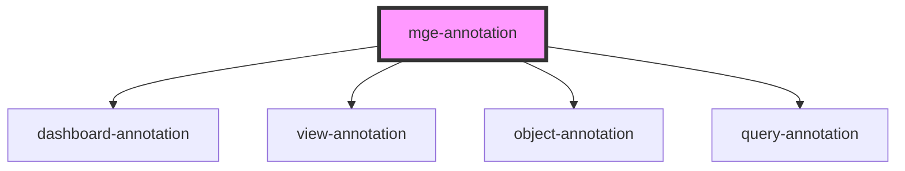

# mge-annotation

<!-- Auto Generated Below -->

## Properties

| Property         | Attribute         | Description          | Type      | Default       |
| ---------------- | ----------------- | -------------------- | --------- | ------------- |
| `_dashboard`     | `_dashboard`      | The parent dashboard | `any`     | `undefined`   |
| `_view`          | `_view`           |                      | `any`     | `undefined`   |
| `disabled`       | `disabled`        |                      | `boolean` | `false`       |
| `formAnnotation` | `form-annotation` |                      | `any`     | `null`        |
| `height`         | `height`          |                      | `number`  | `350`         |
| `idannotation`   | `idannotation`    |                      | `any`     | `undefined`   |
| `initComponent`  | `init-component`  |                      | `string`  | `"mge-query"` |
| `parents`        | --                |                      | `any[]`   | `[]`          |
| `width`          | `width`           |                      | `number`  | `350`         |

## Methods

### `setBox(_: any) => Promise<any>`

#### Returns

Type: `Promise<any>`

## Dependencies

### Depends on

- [dashboard-annotation](../dashboard-annotation)
- [view-annotation](../view-annotation)
- [object-annotation](../object-annotation)
- [query-annotation](../query-annotation)

### Graph

----------------------------------------------

*Built with [StencilJS](https://stenciljs.com/)*
