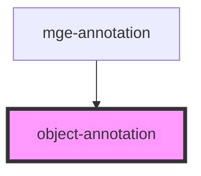

# view-annotation

<!-- Auto Generated Below -->

## Properties

| Property       | Attribute       | Description | Type     | Default     |
| -------------- | --------------- | ----------- | -------- | ----------- |
| `height`       | `height`        |             | `number` | `350`       |
| `idAnnotation` | `id-annotation` |             | `string` | `undefined` |
| `width`        | `width`         |             | `number` | `350`       |

## Dependencies

### Used by

 - [mge-annotation](../mge-annotation)

### Graph

----------------------------------------------

*Built with [StencilJS](https://stenciljs.com/)*
